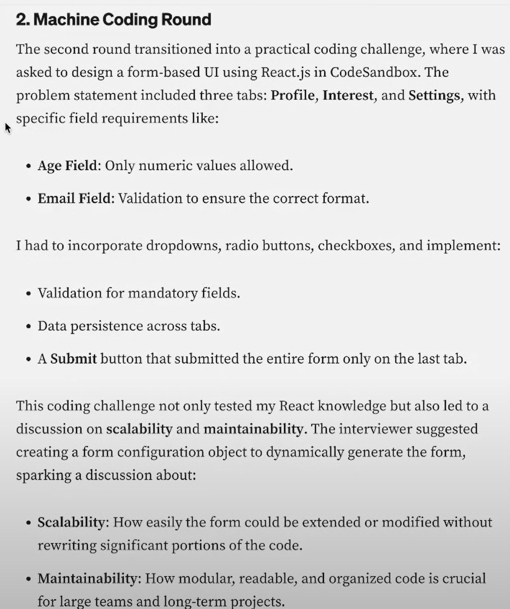

# form-component
Created with CodeSandbox
This project wants to give a solution for a interview question.
1. There are 3 tabs Profile/Interests/Settings
2. Profile tab should contains name/age/eamil properties etc.
3. Validate the input field for Profile 

Results:

